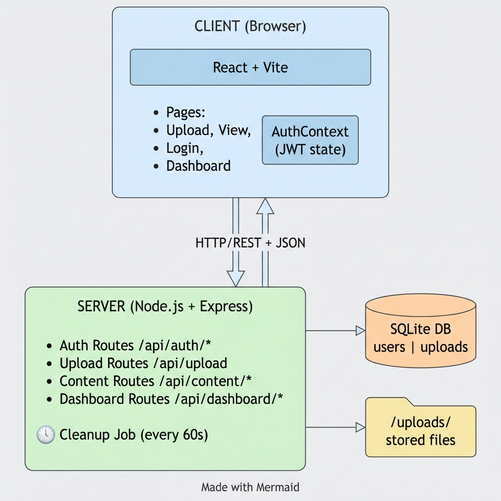
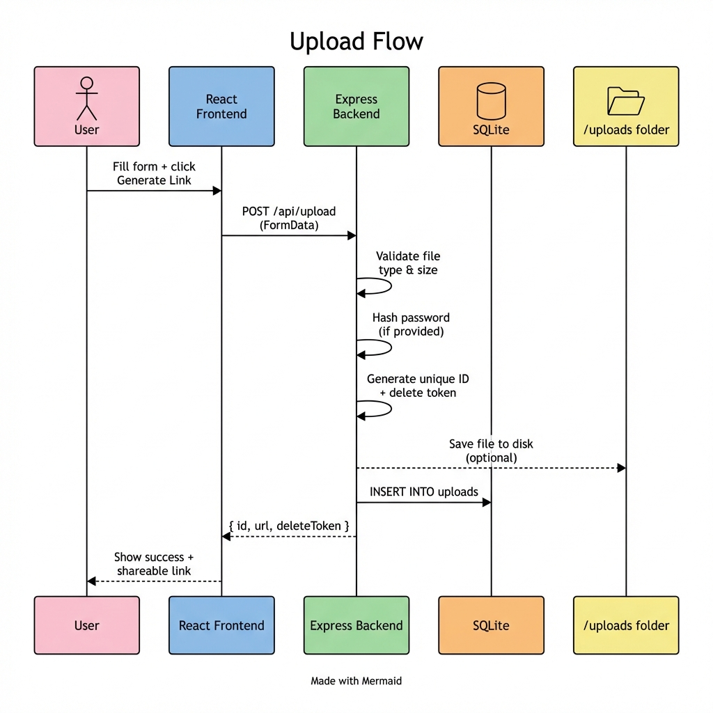
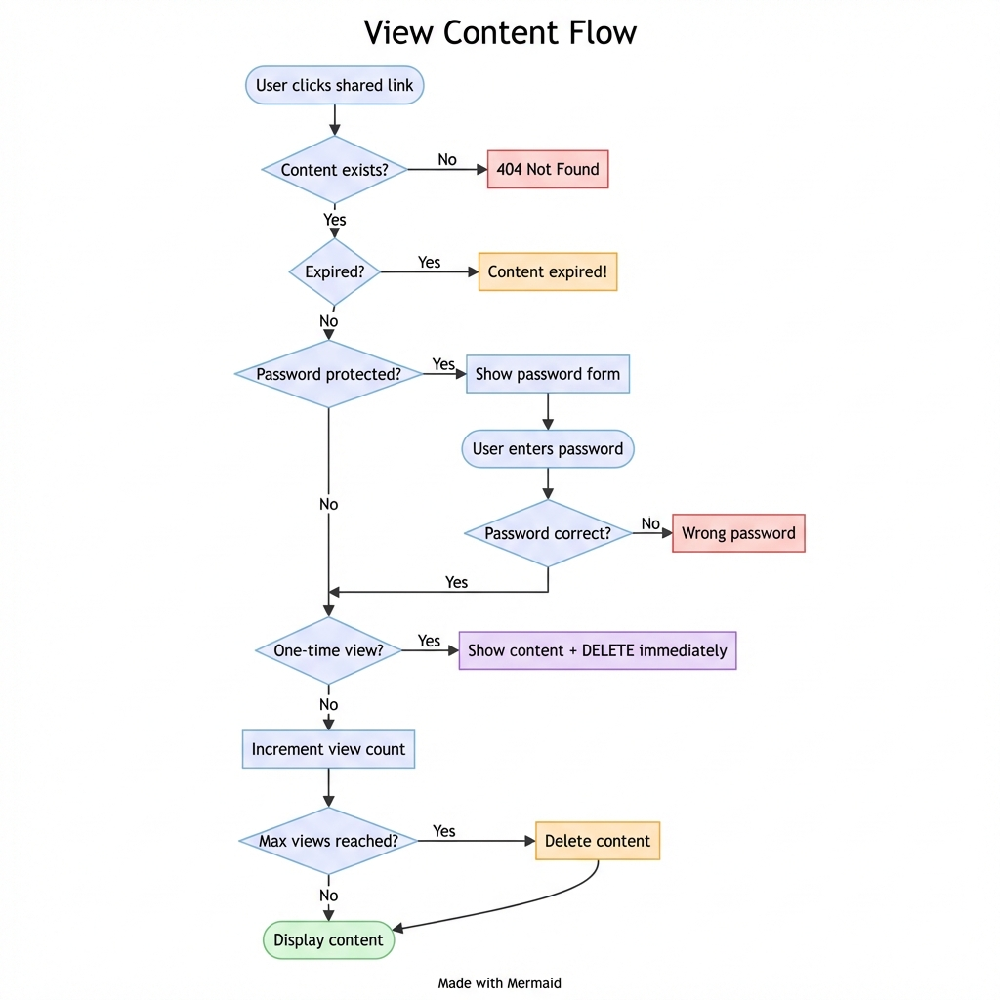
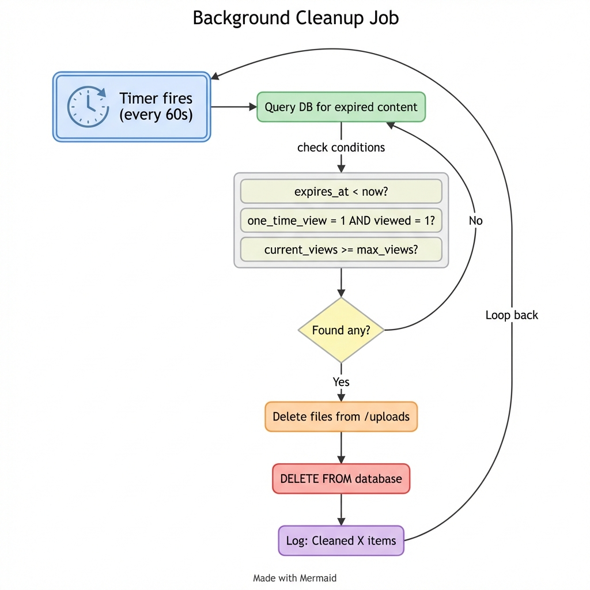
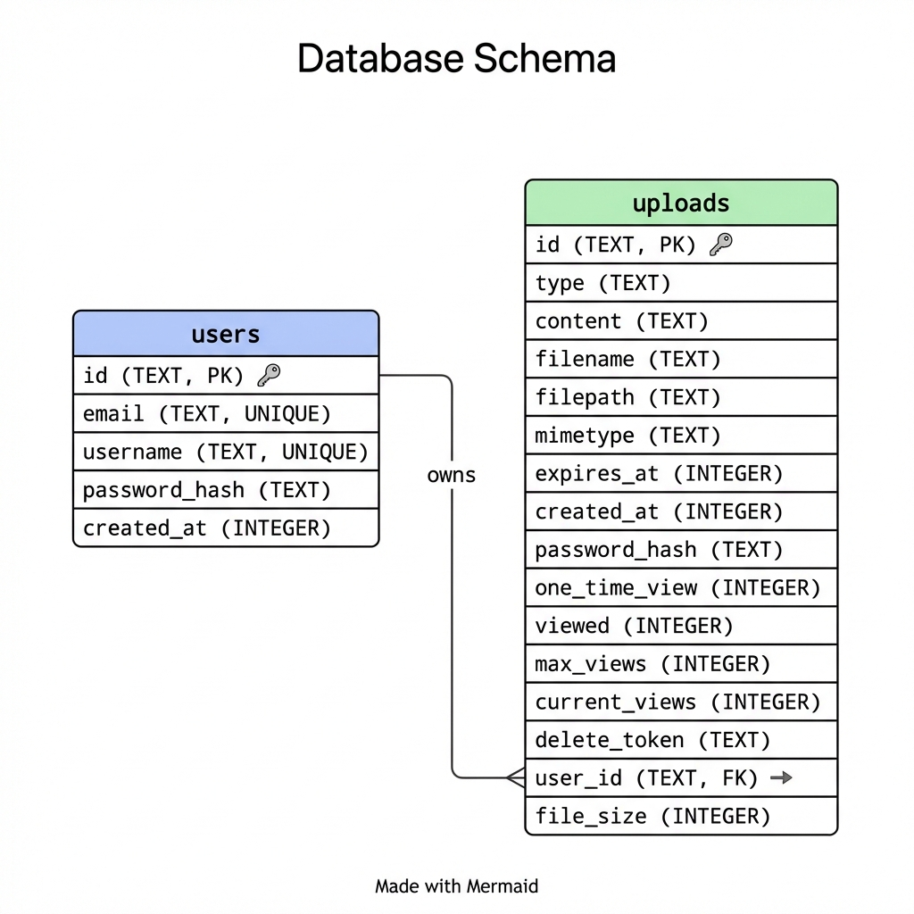

# Ramesh7_LinkVault

A full-stack Pastebin-style web app for secure text and file sharing. Built as a learning project to understand authentication, file handling, and building RESTful APIs from scratch.

---

## What Does This App Do?

Think of it like a private Pastebin - you paste some text or drop a file, get a unique link, share it with whoever you want, and it disappears after some time. Pretty simple concept, but I added some extra stuff to make it more useful:

- Password protect your links (so only people with the password can see)
- One-time view (content deletes itself after someone sees it once - like Snapchat for text!)
- Limit how many times something can be viewed
- User accounts if you want to track your uploads
- Works without signing up too

---

## System Architecture




---

## Tech Stack

| Layer | Tech | Why I Picked It |
|-------|------|-----------------|
| Frontend | React + Vite | Fast dev server, modern tooling |
| Styling | Vanilla CSS | Wanted full control, no framework bloat |
| Backend | Node.js + Express | JavaScript everywhere, quick to build |
| Database | SQLite (sql.js) | No setup needed, just works |
| Auth | JWT + bcrypt | Industry standard, stateless tokens |

---

## Project Structure

```
linkvault/
├── backend/
│   ├── server.js              # Express app entry point
│   ├── database.js            # SQLite setup + migrations
│   ├── routes/
│   │   ├── auth.js            # Login/register endpoints
│   │   ├── upload.js          # File & text upload
│   │   ├── content.js         # Retrieve + delete content
│   │   └── dashboard.js       # User's uploads list
│   └── middleware/
│       ├── authMiddleware.js  # JWT verification
│       ├── fileValidation.js  # Check file types/sizes
│       └── cleanup.js         # Background job for expired stuff
│
├── frontend/
│   ├── src/
│   │   ├── context/
│   │   │   └── AuthContext.jsx  # Global auth state
│   │   ├── pages/
│   │   │   ├── Upload.jsx       # Main upload form
│   │   │   ├── View.jsx         # View shared content
│   │   │   ├── Login.jsx        # Login page
│   │   │   ├── Register.jsx     # Signup page
│   │   │   └── Dashboard.jsx    # User's links
│   │   ├── App.jsx
│   │   └── index.css
│   └── vite.config.js
│
└── uploads/                   # Where uploaded files live
```

---

## Setup Instructions

### You'll Need
- Node.js 18 or higher (I used v20)
- npm (comes with Node)

### Step 1: Backend

```bash
cd backend
npm install
npm start
```

You should see:
```
🔐 LinkVault API Server v2.0 running on http://localhost:3001
📦 Features: Auth, Password Protection, One-Time View, Max Views
🔄 Cleanup job started (runs every 60s)
```

### Step 2: Frontend (new terminal)

```bash
cd frontend
npm install
npm run dev
```

Should show:
```
VITE ready
➜ Local: http://localhost:5173/
```

### Step 3: Open Your Browser

Go to http://localhost:5173 and you're good!

---

## API Overview

### Authentication

| Endpoint | Method | What It Does |
|----------|--------|--------------|
| `/api/auth/register` | POST | Create new account |
| `/api/auth/login` | POST | Get JWT token |
| `/api/auth/me` | GET | Who am I? (needs token) |

**Register Example:**
```json
POST /api/auth/register
{
  "email": "test@example.com",
  "username": "testuser",
  "password": "secret123"
}
```

### Upload

| Endpoint | Method | What It Does |
|----------|--------|--------------|
| `/api/upload` | POST | Upload text or file |

**Upload with options:**
```
POST /api/upload (multipart/form-data)

Fields:
- text: "your content here"
- file: (binary file)
- expiresAt: "2026-02-08T12:00:00Z"
- password: "optional-password"
- oneTimeView: true
- maxViews: 5
```

**Response:**
```json
{
  "success": true,
  "id": "abc123xyz789",
  "url": "/v/abc123xyz789",
  "deleteToken": "xyz789abc123...",
  "hasPassword": true,
  "oneTimeView": true,
  "maxViews": 5
}
```

### Content

| Endpoint | Method | What It Does |
|----------|--------|--------------|
| `/api/content/:id` | GET | Get content (checks password if protected) |
| `/api/content/:id/verify` | POST | Unlock with password |
| `/api/content/:id/download` | GET | Download file |
| `/api/content/:id` | DELETE | Delete (needs token or be owner) |

### Dashboard (logged in users only)

| Endpoint | Method | What It Does |
|----------|--------|--------------|
| `/api/dashboard/uploads` | GET | All your uploads |
| `/api/dashboard/stats` | GET | Your stats |

---

## Data Flow Diagrams

### Upload Flow




### View Content Flow




### Background Cleanup Job




---

## Database Schema




---

## Design Decisions

### Why SQLite instead of MongoDB or Postgres?

Honestly? Zero setup. For a project like this where I'm not expecting millions of users, SQLite just works. The sql.js library means no native bindings either - pure JavaScript. If this needed to scale, I'd swap to Postgres, but for learning/demo purposes SQLite is perfect.

### Why JWT instead of Sessions?

Stateless is simpler. No need to manage sessions on the server. The token contains everything needed to identify the user. Downside is you can't really "log out" someone server-side, but for this app that's fine.

### Why store files on disk instead of S3?

Keeping it simple for local dev. The `/uploads` folder just works. In production you'd definitely want S3 or similar, but that's out of scope here.

### Why nanoid for IDs?

- URL-safe (no weird characters)
- Cryptographically random (can't guess the next one)
- Short enough to share (12 chars)
- No database sequence to leak info

### Why 10-minute default expiry?

Feels right for quick shares. Long enough to share something, short enough that forgotten links don't stick around forever. Users can always set longer if needed.

### Why optional auth?

The core use case is "quick share without friction". Forcing login would kill that. Auth is there for power users who want to track their stuff.

---

## Assumptions and Limitations

### What I Assumed

- **Single server**: This isn't designed to run on multiple servers. No Redis for sessions, no distributed file storage.

- **Trusted uploads**: I'm not scanning files for viruses. In production you'd want ClamAV or similar.

- **Local timezone**: Expiry times use the server's timezone. Could cause weird behavior if client/server differ wildly.

- **Small files**: 50MB limit. Good enough for documents, not for video hosting.

### Known Limitations

| Limitation | Why It's Like That |
|------------|-------------------|
| 50MB file limit | Multer's default, could increase but didn't want huge files |
| No file encryption at rest | Would need crypto setup, out of scope |
| No rate limiting | Should add express-rate-limit for production |
| SQLite single-write | Can't handle concurrent heavy writes |
| No email verification | Kept auth simple for demo purposes |
| Files stored unencrypted | Security tradeoff for simplicity |

### What Could Be Better

- Add rate limiting (prevent spam)
- Email verification for accounts
- File encryption at rest
- CDN for file delivery
- Proper logging (winston or similar)
- Unit tests (yeah I should write those)

---

## Security Notes

- Passwords hashed with bcrypt (10 rounds)
- JWTs expire in 7 days
- Content IDs are random (can't enumerate)
- Delete requires token (can't delete others' stuff)
- Invalid/expired links return 403 (no info leak)
- File types restricted (no executables)

---

## Want to Contribute?

This is a learning project but PRs are welcome if you want to:
- Add tests
- Improve the UI
- Fix bugs
- Add features

---

## License

MIT - do whatever you want with it.

---

Created by Ramesh Choudhary - IIT Kharagpur
