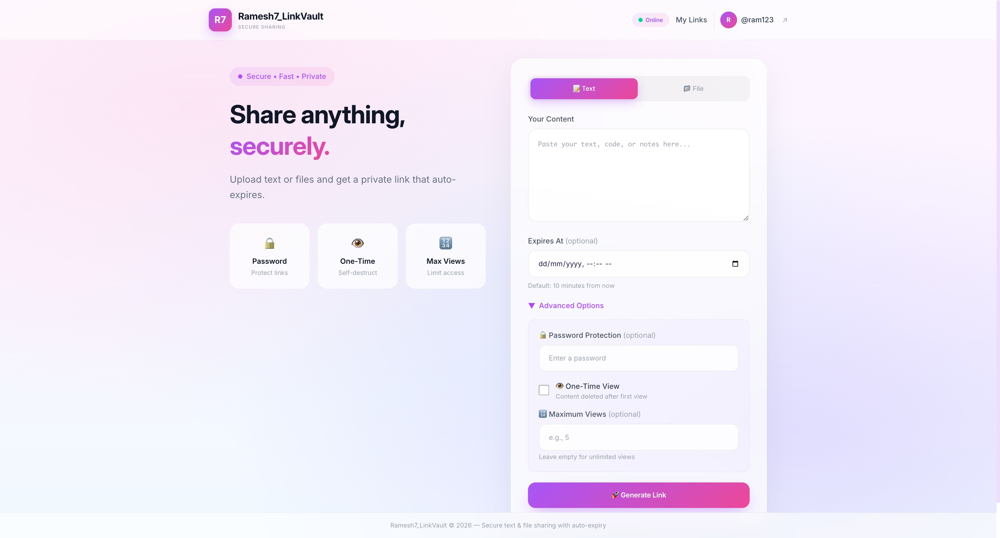
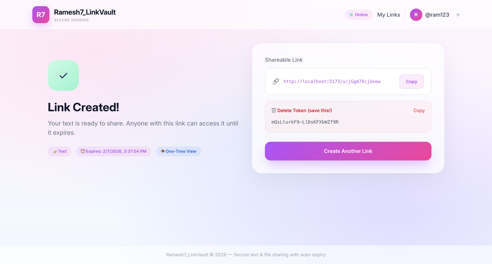
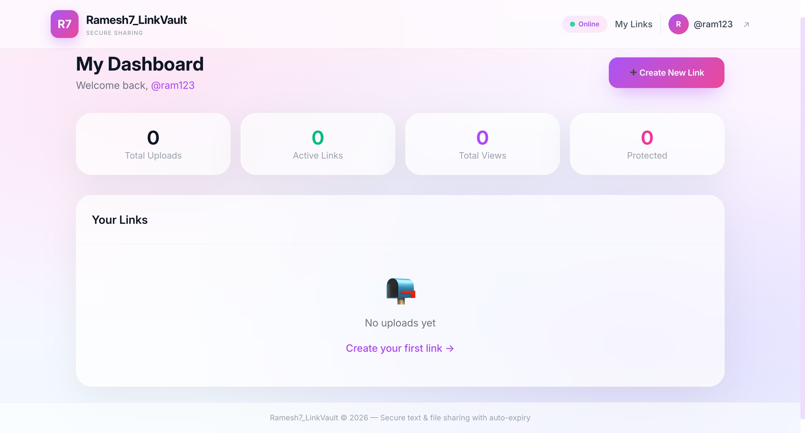
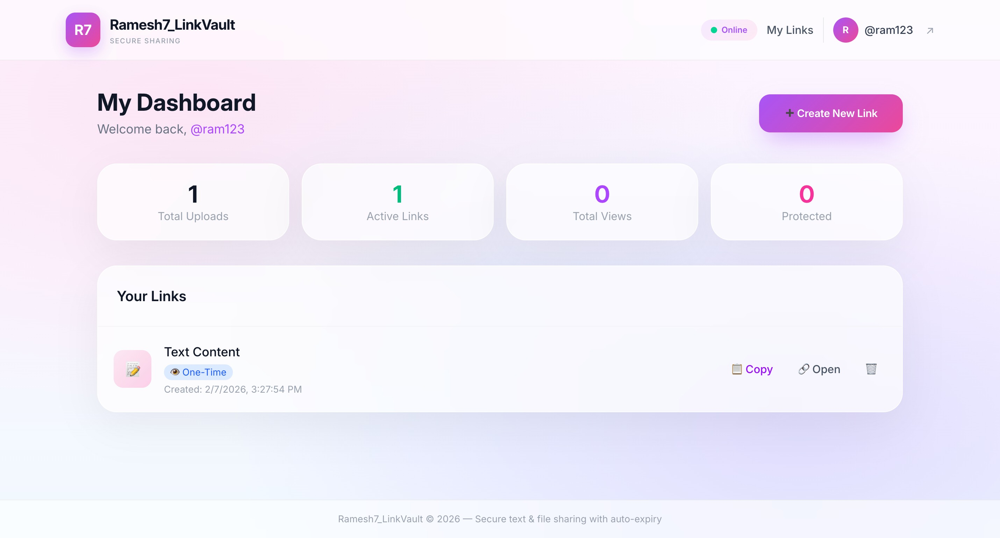

# 🚀 How to Start Ramesh7_LinkVault

> Secure text & file sharing with Auth, Password Protection, One-Time View & Self-Destruct Links

---

## Prerequisites

- **Node.js** v18 or higher (recommended: v20)
- **npm** (comes with Node.js)

---

## ✨ Features

| Feature | Description |
|---------|-------------|
| 🔐 User Authentication | Register & Login with JWT |
| 🔑 Password-Protected Links | Only accessible with correct password |
| 👁️ One-Time View | Content self-destructs after first view |
| 🔢 Max View Count | Limit how many times content can be viewed |
| 🗑️ Manual Delete | Delete with secure token |
| 📁 File Validation | File size & type checks |
| 📊 User Dashboard | Track all your shared links |
| 🧹 Auto Cleanup | Background job removes expired content |

---

## Step 1: Start the Backend Server

Open a terminal and run:

```bash
cd backend
npm install      # first time only
npm start
```

You should see:
```
🔐 LinkVault API Server v2.0 running on http://localhost:3001
📦 Features: Auth, Password Protection, One-Time View, Max Views
🔄 Cleanup job started (runs every 60s)
```

> ⚠️ Keep this terminal window open!

---

## Step 2: Start the Frontend (New Terminal)

Open a **new** terminal window and run:

```bash
cd frontend
npm install      # first time only
npm run dev
```

You should see:
```
VITE ready
➜  Local:   http://localhost:5173/
```

> ⚠️ Keep this terminal window open too!

---

## Step 3: Open the App

Open your browser and go to:

### 👉 **http://localhost:5173**

---

## App Screenshots

### Landing Page — Upload Interface


The main upload interface with:
- Text/File toggle
- Large text area for content
- Expiry time picker
- Password protection option
- One-time view toggle
- "Generate Secure Link" button

---

### Success Page — Link Generated


After uploading, you get:
- A unique shareable URL
- Copy-to-clipboard button
- Expiry timestamp
- Delete token for manual removal
- "Create Another Link" button

---

### View Page — Shared Content


When someone opens your link:
- Displays text content in a code block
- Copy Text button
- Shows Created & Expires timestamps
- Download button for file uploads
- Password prompt if protected

---

### User Dashboard


Logged-in users can:
- View all their active uploads
- Track view counts
- Delete links directly


---

## API Endpoints

### Authentication
| Endpoint | Method | Description |
|----------|--------|-------------|
| `/api/auth/register` | POST | Create new account |
| `/api/auth/login` | POST | Login & get JWT token |
| `/api/auth/me` | GET | Get current user info |

### Upload & Content
| Endpoint | Method | Description |
|----------|--------|-------------|
| `/api/upload` | POST | Upload text or file |
| `/api/content/:id` | GET | Get content by ID |
| `/api/content/:id/verify` | POST | Verify password |
| `/api/content/:id/download` | GET | Download file |
| `/api/content/:id` | DELETE | Delete with token |

### Dashboard (Auth Required)
| Endpoint | Method | Description |
|----------|--------|-------------|
| `/api/dashboard/uploads` | GET | Your uploads list |
| `/api/dashboard/stats` | GET | Your statistics |

---

## Ports Used

| Service | Port | URL |
|---------|------|-----|
| Backend | 3001 | http://localhost:3001 |
| Frontend | 5173 | http://localhost:5173 |

---

## Stopping the Servers

Press `Ctrl + C` in each terminal window.

---

## Quick Start (Copy-Paste)

**Terminal 1 (Backend):**
```bash
cd backend && npm install && npm start
```

**Terminal 2 (Frontend):**
```bash
cd frontend && npm install && npm run dev
```

---

## Troubleshooting

| Issue | Solution |
|-------|----------|
| ❌ "localhost refused to connect" | Make sure **both** servers are running |
| ❌ "Port already in use" | Stop the other process or change port |
| ❌ "Module not found" | Run `npm install` in that folder |
| ❌ "Invalid or expired token" | Login again — JWT sessions expire in 7 days |

---

*Ramesh7_LinkVault v2.0 © 2026 — Created by Ramesh Choudhary, IIT Kharagpur*
